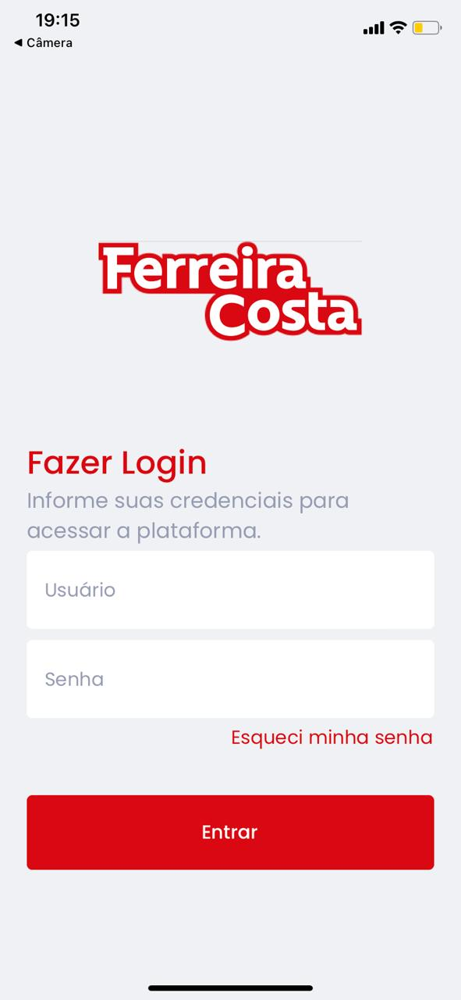
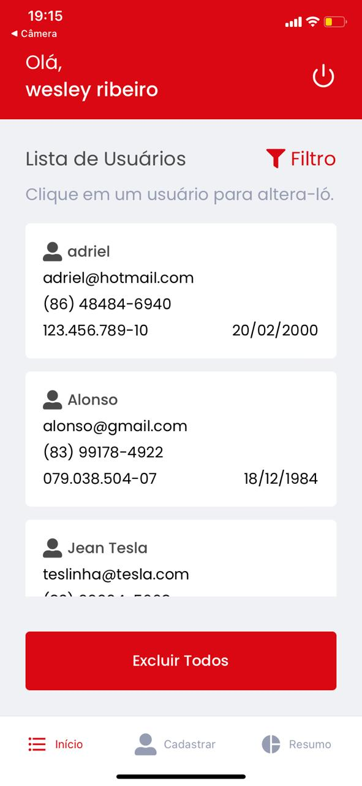
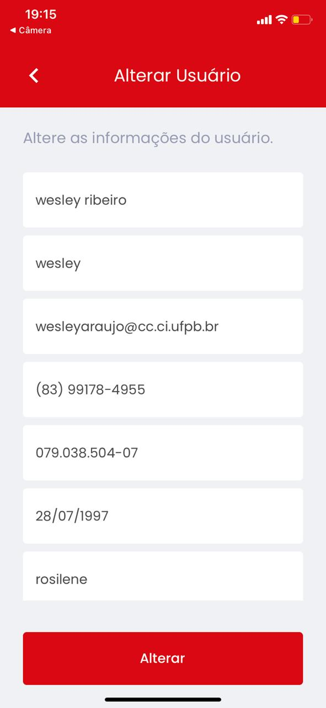
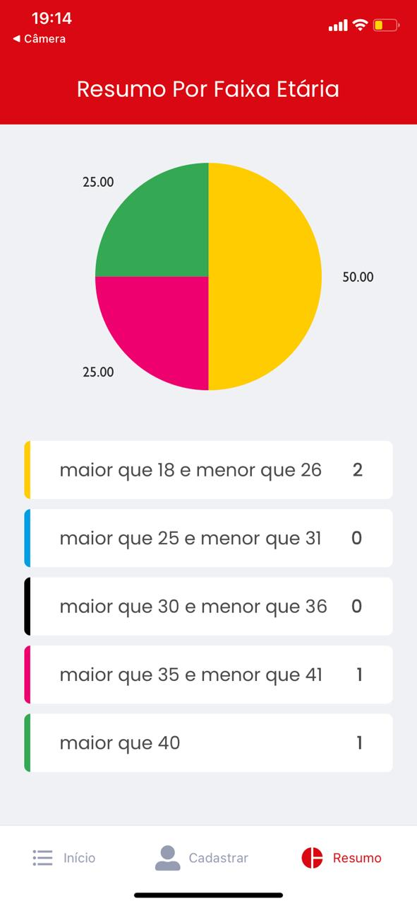

## App Ferreira Costa 
   
    
## Protótipo
https://www.figma.com/file/HsMz58RrXkqxLCScrwuIjJ/Projeto-app-avaliação-FC?node-id=0%3A1

## Como usar
**1** - Faça um clone do repositório para sua máquina

    git clone https://github.com/wesley-rfa/appFC.git
**2** - execute o comando expo start

## Sobre

App desenvolvido com React Native utilizando o expo e TypeScript. A estilização foi feita com o styled-components.

A API foi feita com PHP utilizando o banco de dados MySql.

## Funcionalidades

**1** - Login

**2** - Recuperar senha

**3** - CRUD de usuários

**4** - Filtro na listagem dos usuários

**5** - Gráfico de resumo por faixa etária
   

## Exemplos

